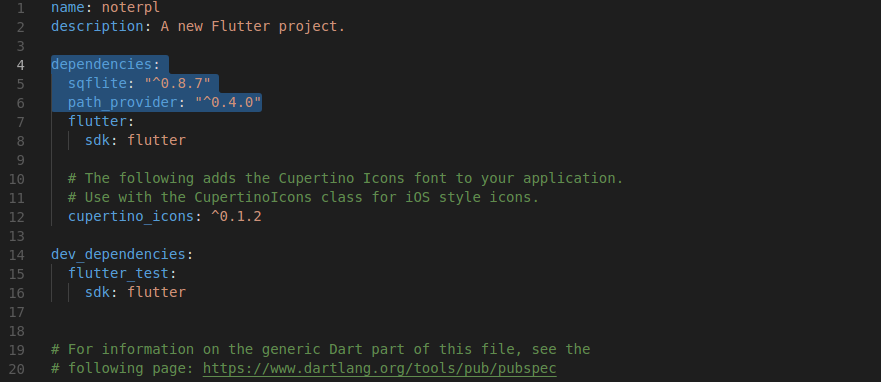

#Membuat Catatan menggunakan Flutter

###Persyaratan Untuk memulai
1. Menginstall Flutter pada [Modul Sebelumnya](https://github.com/DjohanP/RPL-Pelatihan-Flutter/blob/master/Modul_1_Install.md)
2. Menyiapakan AVD Manager
3. Menginstall dependencies pada pubspec.yaml dengan menambahkan dua baris(sqflite: "^0.8.7",path_provider: "^0.4.0")

## Langkah-langkah
### i. Membuat Class Note.dart
Class Note adalah object yang akan memiliki 3 atribut yaitu id,title, dan descritpion.

    import 'package:meta/meta.dart';
    class Note{
        int id;
        String title;
        String descritpion;

        Note({@required this.title, @required this.descritpion, this.id});

        Map<String,String>toMap(){
            Map<String, String> map = {"title": title, "description": descritpion};
            return map;
        }

        Note.fromMap(Map map){
            id = map["_id"];
            title = map["title"];
            descritpion = map["description"];
        }
    }
**Penjelasan**
- import 'package:meta/meta.dart'; library yang digunakan untuk @required pada line ke-7
- Pada line ke-7 adalah constructor untuk membuat class Note
- Fungsi toMap digunakan untuk membuat type map yang digunakan pada file [databasenote.dart](lib/databasenote.dart)
- Fungsi fromMap digunakan pendeklrasian bentuk map yang dgiunakan pada file [databasenote.dart](lib/databasenote.dart)

### ii. Membuat File databasenote.dart
File ini digunakan untuk melakakukan CRUD dengan database sqllite. Dokumentasi sqflite dapat dilihat [di sini](https://pub.dartlang.org/packages/sqflite#-readme-tab-)

    import 'dart:async';
    import 'dart:io';//directory
    import 'package:noterpl/note.dart';
    import 'package:path/path.dart';//join
    import 'package:sqflite/sqflite.dart';
    import 'package:path_provider/path_provider.dart';

    final String TABLE_NAME = "notes";
    final String ID = "_id";
    final String TITLE = "title";
    final String DESCRIPTION = "description";

    class DatabaseNote{
        Database _database;
        Future opendb() async{
            if (_database == null) {
            Directory directory=await getApplicationDocumentsDirectory();
            _database=await openDatabase(
                join(directory.path,"notes.db"),
                version: 1,
                onCreate: (Database db,int version)async{
                await db.execute(
                    '''create table $TABLE_NAME ( 
                    $ID integer primary key autoincrement, 
                    $TITLE text not null,
                    $DESCRIPTION text not null)'''
                );
                }
            );
            }
        }

        Future<int> insertNote(Note note)async{
            await opendb();
            return await _database.insert(TABLE_NAME, note.toMap());
        }

        Future<List<Note>> getNotes() async {
            await opendb();
            List<Map> entities = await _database.rawQuery("select * from $TABLE_NAME");
            //print(entities);
            return entities.map((map) => new Note.fromMap(map)).toList();
        }

        Future deleteNote(int id) async {
            await opendb();
            await _database.delete(TABLE_NAME, where: "$ID = ?", whereArgs: [id]);
        }

        Future updateNote(Note note) async {
            await opendb();
            await _database.update(TABLE_NAME, note.toMap(), where: "$ID = ?", whereArgs: [note.id]);
        }

        closeDb() {
            _database.close();
        }
    }

###iii. Membuat Tampilan Edit dan Add Catatan
Code dapat dilihat [di sini](lib/detailnote.dart)
**Penjelasan**
- Fungsi _submit digunakan untuk menyimpan ke database dan mengecek validator
- if else dart menggunakan condition ? (jika true) : jika false,

###iv. Membuat main.dart
[main.dart](lib/main.dart) adalah file awal yang digunakan untuk memulai aplikasi